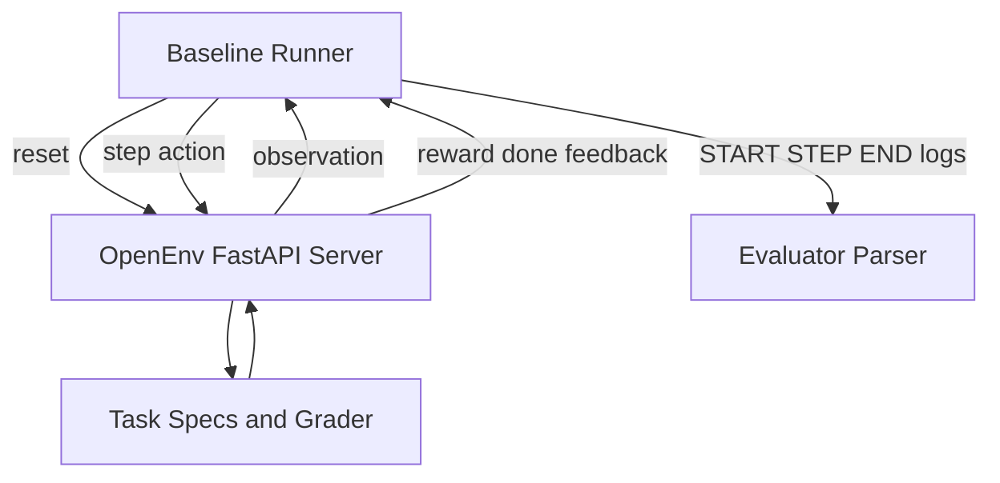

# Architecture and Data Flow

## High-Level Components
1. Environment Server
- FastAPI app exposing OpenEnv-compatible reset and step endpoints.
- Task simulation and grading logic.

2. Typed Interface Layer
- Action and observation schemas used by both server and client.

3. Baseline Agent Runner
- Inference loop calling model endpoint via OpenAI SDK compatible API.
- Emits parser-safe START/STEP/END logs.

4. Validation and Deployment
- OpenEnv validation checks.
- Docker build path.
- HF Space runtime endpoint.

## Sequence Flow
1. Agent calls reset.
2. Environment selects next deterministic task and returns observation context.
3. Agent submits analysis/fix/root_cause/done action.
4. Environment grades action and returns reward, done, and feedback.
5. Loop continues until done or max_steps.
6. Runner emits END line with explicit task_id and score.

## Mermaid Diagram

## Design Notes
- Deterministic task behavior supports reproducible comparisons.
- Guardrails reduce unsafe remediation suggestions.
- Output contract is evaluator-friendly and stable under validation constraints.
